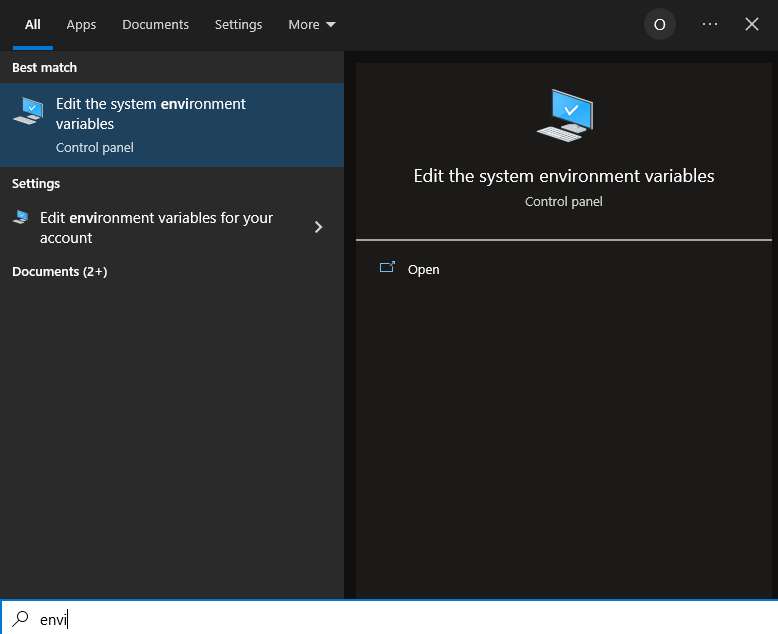
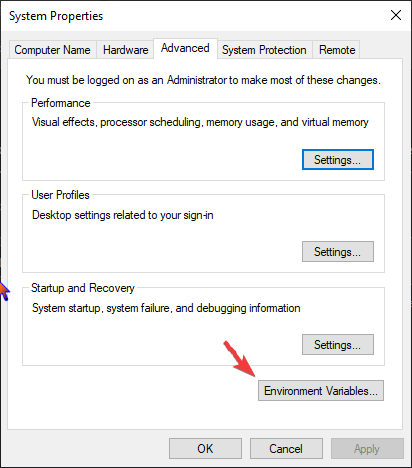
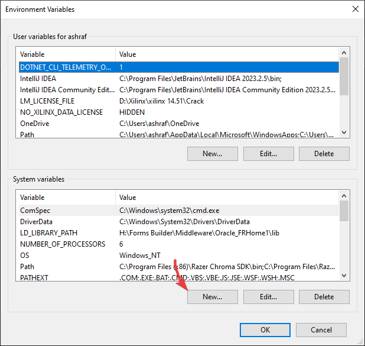
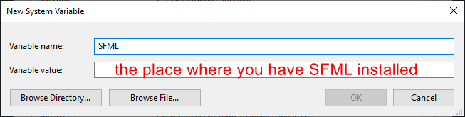

# **Setting up SFML**
## *Step 0:*
- Download SFML from this link: [SFML](https://www.sfml-dev.org/files/SFML-2.6.1-windows-vc17-64-bit.zip)

- Extract it to a folder and mark its location down

## *Step 1:*
- Search for Environment in the Windows Search Bar

  

## *Step 2:*
- Click Environment Variables

  

## *Step 3:*
- Click New

  

## *Step 4:*
- Copy the text in the image

  

## *Step 5:*
- Restart your device
